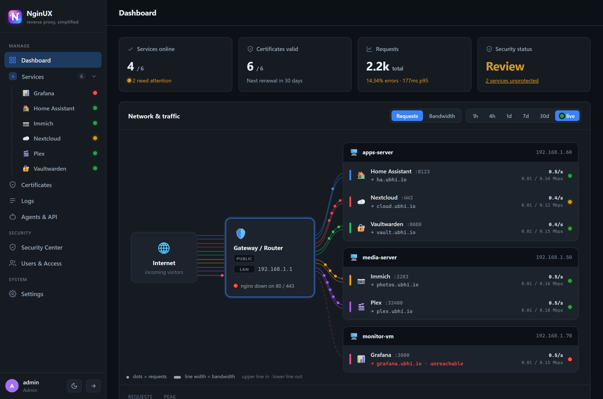
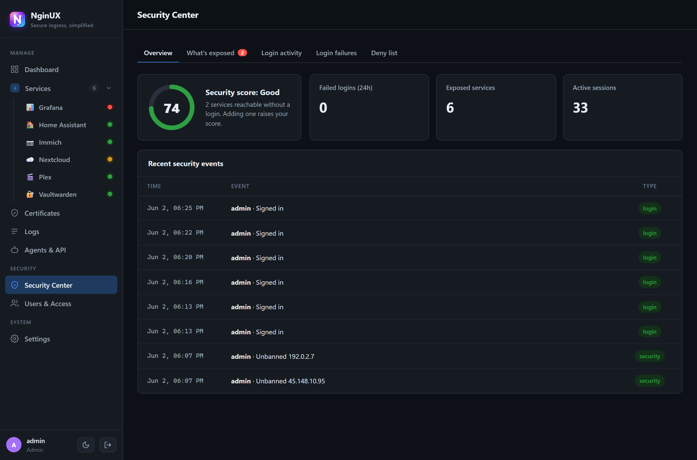
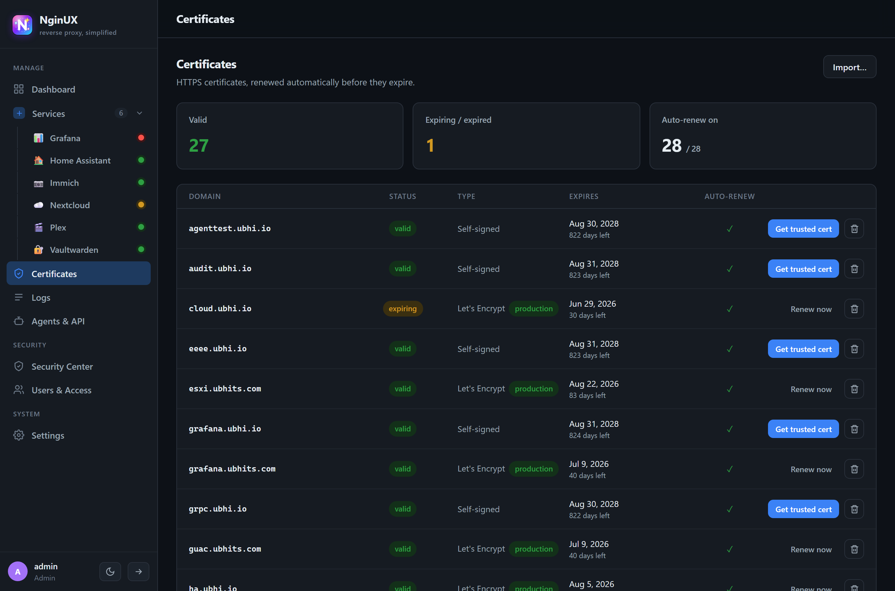
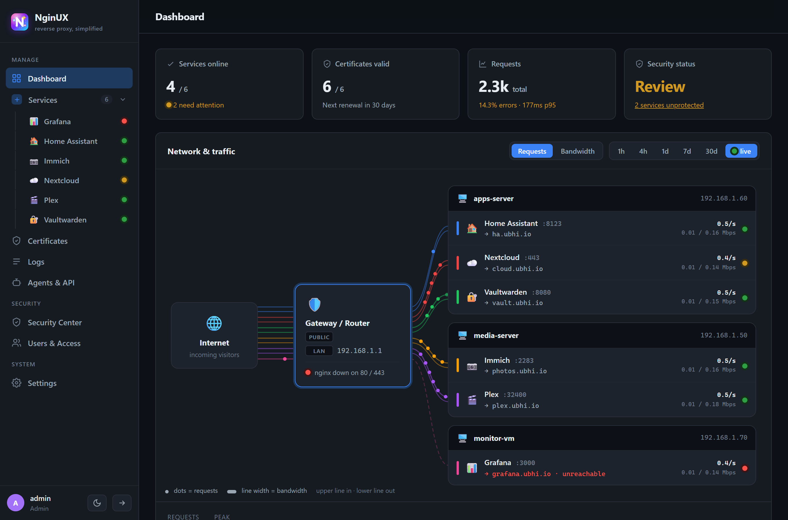
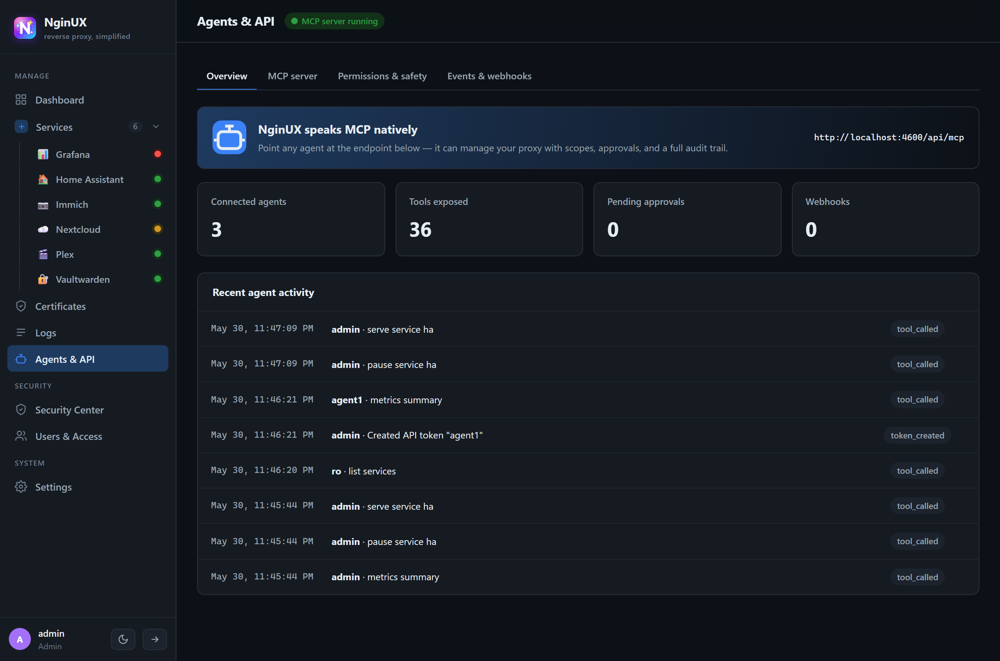

# NginUX

**A friendly, container-native control plane for an Nginx reverse proxy.**

NginUX puts a beginner-friendly web UI in front of Nginx so you can expose your
self-hosted services (Plex, Immich, Nextcloud, Home Assistant, Vaultwarden,
Grafana, …) without hand-editing config files. It generates and reloads real
Nginx config, manages TLS certificates, gates services behind login/2FA, watches
traffic, and exposes a first-class agent/automation API — all from a single
Docker image that runs anywhere Docker runs (Windows, Linux, NAS, macOS).

It's a friendlier alternative to hand-written nginx, Nginx Proxy Manager, or
SWAG — with a built-in agent/MCP API on top. One `docker compose up`, no nginx
config required.



> ⚠️ **Keep the control plane (`:4600`) on your LAN — never port-forward it.**
> Only the data plane (`:80`/`:443`) should face the internet, and set a strong
> admin password before exposing anything. See [Deploying securely](SECURITY.md#deploying-securely).

---

## Highlights

- **Zero-edit reverse proxy** — describe a service in the UI; NginUX writes the
  Nginx `server` / `stream` blocks and test-and-reloads safely.
- **Network topology dashboard** — Internet → gateway (public/LAN IP) → servers →
  services tree, plus a multi-range traffic graph (1h / 4h / 1d / 7d / 30d).
- **TLS done for you** — self-signed / internal CA out of the box, or Let's
  Encrypt via HTTP-01 / DNS-01 with auto-renewal.
- **Security-first** — login + RFC-6238 TOTP 2FA, forward-auth gate, per-host
  protections, GeoIP country lock, fail2ban-style auto-banning, audit log, and a
  Security Center that scores your exposure.
- **First-party agent integration** — MCP server (JSON-RPC over HTTP), SSE event
  stream, signed webhooks, and scoped API tokens with risk-tiered approvals.
- **Observability** — JSON access-log pipeline → live tail, status/latency
  aggregates, top IPs/paths/countries, a traffic world map, and a Prometheus
  exporter for Grafana.
- **Runs anywhere** — one image (Nginx data plane + Node control plane), state on
  a single mounted volume.

---

## Screenshots

| Security Center | Certificates |
| --- | --- |
| [](docs/img/security.png) | [](docs/img/certificates.png) |
| **Services** | **Agents & API** |
| [](docs/img/services.png) | [](docs/img/agents.png) |

<sub>Regenerate these from a running instance with `node scripts/screenshots.mjs` (uses your installed Chrome/Edge).</sub>

---

## Quick start

### Docker (recommended)

```bash
docker compose up -d          # pulls ghcr.io/ubhits/nginux:latest
# UI: http://localhost:4600
```

The image is published publicly to GitHub Container Registry, so no login is
needed. To pull it directly (e.g. to add NginUX as a service in an existing
compose stack), reference the **fully-qualified** name — a bare `nginux` resolves
to Docker Hub and will fail with "pull access denied":

```bash
docker pull ghcr.io/ubhits/nginux:latest
# in compose:   image: ghcr.io/ubhits/nginux:latest
```

Ports: `4600` = control-plane UI/API · `80`/`443` = proxied traffic (data plane).
State (SQLite DB, generated Nginx config, certs, logs) lives on the `nginux-data`
volume mounted at `/data`.

### Local development

Requires **Node ≥ 22.5** (the server runs `.ts` directly via Node's type
stripping + built-in `node:sqlite`; no build step for the backend).

```bash
npm install
npm run dev          # api + web with hot reload (concurrently)
# or run the production build locally:
npm run build        # builds the web bundle (+ server check)
npm start            # serves API + built UI on http://localhost:4600
```

**Default admin login:** `admin` / `admin` — you'll be required to set a new password on first sign-in. (Set `NGINUX_ADMIN_PASSWORD` to skip the default.)

The CLI talks to the control plane over MCP/REST:

```bash
npm run cli -- <command>
```

---

## Features

### Proxy & routing
- HTTP/HTTPS (L7) reverse proxy with WebSockets, HTTP/2, and HTTP→HTTPS redirect.
- **Multi-protocol:** TCP & UDP streams (L4), gRPC (`grpc_pass`), and
  **SNI / TLS passthrough** (`ssl_preread`, no termination).
- **Load balancing** across multiple upstreams (round-robin / least-conn / ip-hash).
- **Per-path routing** — send specific paths to different backends.
- **Per-host limits & quotas** — download speed cap (`limit_rate`) and max
  concurrent connections per IP (`limit_conn`).
- Service presets (Plex, Immich, Nextcloud, Home Assistant, Vaultwarden, Grafana…),
  maintenance mode, custom headers, and raw custom-Nginx escape hatch.
- Generated config is human-readable; failed validations are translated into
  plain-language guidance and never applied (nothing goes down).

### TLS / certificates
- Self-signed / internal CA via `node-forge` so Nginx always boots.
- Let's Encrypt issuance over **HTTP-01** and **DNS-01** (`acme-client`).
- Auto-renewal scheduler with expiry tracking and a Certificates dashboard.
- **mTLS** — per-host managed client CA; issue/revoke client certs and require
  them with `ssl_verify_client`.

### DNS automation
- Pluggable provider interface with **GoDaddy** and **Cloudflare** adapters
  (used for record management and DNS-01 challenges). Credentials are entered in
  Settings at runtime.

### Auth & security
- Password auth (scrypt) with DB-backed sessions + httpOnly cookies.
- **2FA (TOTP)** with backup codes (dependency-free implementation).
- **Forward-auth SSO** — put any service behind a NginUX sign-in (see below).
- Per-host **require login / require 2FA / GeoIP country lock**.
- Per-host protections: security headers, HSTS, IP allow/deny, exploit & bad-bot
  blocking, request rate limiting.
- **fail2ban-style auto-banning** (auto-ban after repeated auth failures) plus
  manual bans, written to a shared `banned.conf`.
- **Security Center** — exposure map, posture score, login/failure audits.
- Full **audit log** of every change.

#### Protect a service with login (SSO)

Turning on **Require login** for a service puts an Nginx `auth_request` in front of
it that checks for a valid NginUX session. For an unauthenticated visitor to be
able to *sign in*, do a one-time setup so the session is shared across your
domains:

1. **Expose NginUX itself** as a service on a subdomain of your domain — e.g.
   `nginux.yourdomain.com → 127.0.0.1:4600` — with HTTPS, and **leave that one
   un-gated** (don't tick Require login on it, or you'll lock yourself out of the
   login page).
2. In **Settings → Login gate**, set **NginUX sign-in URL** to that address
   (`https://nginux.yourdomain.com`). Leave **Shared cookie domain** blank to
   derive it (`.yourdomain.com`), or set it explicitly.
3. Tick **Require login** (and optionally **Require 2FA**) on any service.

Now an unauthenticated visitor to a protected service is redirected to the NginUX
sign-in, and after logging in once is sent back — and stays signed in across every
`*.yourdomain.com` service. Set `NGINUX_FORWARD_SECRET` too so the auth endpoint
can't be called directly.

### Agents & automation (first-class)
- **MCP server** over HTTP JSON-RPC (`/api/mcp`): initialize, tools list/call,
  resources, prompts.
- **Scoped, hashed API tokens** (Bearer) with trusted/untrusted trust levels —
  no 2FA required for agents.
- **Risk-tiered tools** (read / low / medium / high) with optional auto-approval
  for trusted agents and a human **approval queue** for the rest.
- **SSE event stream** (`/api/events/sse`) and **HMAC-signed outbound webhooks**.
- **30+ built-in tools** spanning services (list/create/update/enable/delete),
  certificates (issue/renew/autorenew/client-certs), GeoIP, bans, metrics, logs,
  topology, presets, users, and settings — each scope- and risk-tiered, and only
  ever exposed to a caller that holds the matching scope.

### Observability
- Nginx **JSON access log** → tailer → in-memory ring buffer + rolling aggregates
  (status classes, p50/p95, top hosts/IPs/paths/countries).
- **Live log tail** over SSE, **traffic world map**, and per-country breakdown.
- **Prometheus exporter** at `/api/metrics/prometheus` for Grafana.
- **Uptime monitoring** with history bars and incident tracking.

### Notifications
- Channels for **ntfy, Gotify, Pushover, Discord, Slack, Telegram, generic
  webhook, and SMTP email** (`nodemailer`), with per-event routing and test-send.

### Config management
- **Snapshot-before-change** config versioning with diff and restore.
- **Import** an existing `nginx.conf` into managed hosts.
- **Export** the full config, and optional **GitOps** sync (commit config + state
  to a local git repo on every apply).

### UI
- React SPA with a left-hand **services tree**, **3-way theme** (dark / medium /
  light), and screens for Dashboard, Services, Expose-a-Service wizard, Host
  detail, Certificates, Logs, Agents & API, Security Center, Users & Access, and
  Settings.

---

## Architecture

```
                         ┌─────────────────────────── Docker image ───────────────────────────┐
 Browser / Agents  ──▶   │  Node control plane (Fastify, :4600)  ──writes/reloads──▶  Nginx    │
                         │   • REST + MCP + SSE + webhooks                          (data plane)│
                         │   • SQLite (node:sqlite)                                  :80 / :443 │
                         │   • cert manager, DNS, metrics, auth, bans                           │
                         │  State volume: /data (db, conf.d, stream.d, certs, logs)             │
                         └──────────────────────────────────────────────────────────────────────┘
```

- **Backend** (`server/`): TypeScript on Fastify 5, `node:sqlite`, zod validation,
  `node-forge` (certs/mTLS), `acme-client` (Let's Encrypt), `nodemailer` (email).
  Runs `.ts` directly via Node 24 type-stripping.
- **Frontend** (`web/`): Vite 6 + React 18 + TypeScript; state-based routing,
  design system ported from the original `mockup.html`.
- **CLI** (`cli/`): an MCP/REST client (`nginux.mjs`).
- **Docker** (`docker/`, `Dockerfile`, `docker-compose.yml`): multi-stage build,
  Nginx + Node in one image, single `/data` volume.

### Project layout

```
nginux/
├─ server/src/        # control plane
│  ├─ index.ts        # Fastify app + all routes + auth guard
│  ├─ db.ts repo.ts   # SQLite schema, migrations, host repository
│  ├─ nginx.ts        # config generation + test-and-reload
│  ├─ auth.ts totp.ts # sessions, password, 2FA, audit, security posture
│  ├─ certs.ts dns.ts clientcerts.ts   # TLS, ACME, DNS providers, mTLS
│  ├─ tools.ts mcp.ts events.ts tokens.ts  # agent gateway
│  ├─ metrics.ts uptime.ts bans.ts     # observability + protections
│  ├─ notify.ts versioning.ts gitops.ts importer.ts
│  └─ presets.ts types.ts
├─ web/src/pages/     # React screens
├─ cli/               # nginux CLI
├─ docker/            # nginx.conf + entrypoint.sh
└─ Dockerfile  docker-compose.yml
```

---

## API surface (selected)

| Area | Endpoints |
|------|-----------|
| Hosts | `GET/POST /api/hosts`, `GET/PUT/DELETE /api/hosts/:id`, `GET /api/hosts/:id/config`, `/api/hosts/:id/uptime` |
| mTLS | `GET/POST /api/hosts/:id/client-certs`, `DELETE …/:certId` |
| Certificates | `GET /api/certificates`, `POST /api/certificates/:domain/issue|renew`, `PUT …/autorenew` |
| Auth | `POST /api/auth/login|logout`, `GET /api/auth/me|forward`, `POST /api/auth/2fa/setup|verify` |
| Users & security | `/api/users`, `/api/sessions`, `/api/audit`, `/api/security/overview|exposure`, `/api/bans` |
| Config | `/api/config/versions`, `…/:id/diff|restore`, `/api/config/export|import`, `/api/gitops/log` |
| Observability | `/api/metrics/summary`, `/api/metrics/prometheus`, `/api/logs/recent`, `/api/logs/stream` (SSE), `/api/topology`, `/api/traffic` |
| Agents | `POST /api/mcp`, `GET /api/events/sse`, `/api/agents/tools|approvals|overview`, `/api/tokens`, `/api/webhooks` |
| Notifications | `/api/channels`, `…/:id/enabled|test` |

Bearer tokens are accepted on the agent/observability endpoints (`/api/mcp`,
`/api/events`, `/api/logs`, `/api/metrics/prometheus`); everything else uses the
session cookie.

---

## Configuration

Set via environment variables (the Docker image ships sensible defaults):

| Variable | Purpose | Docker default |
|----------|---------|----------------|
| `PUID` / `PGID` | User/group NginUX runs as, so data on the volume is owned by *your* host user (manageable over SMB / a NAS file browser, like other self-hosted containers). **Defaults to the owner of the mounted data directory** — so with a bind-mounted folder NginUX simply runs as whoever owns it, no config needed. nginx still binds `:80`/`:443` via the `NET_BIND_SERVICE` ambient capability. Set both to `0` to run as root. | owner of `/data` |
| `PORT` / `HOST` | Control-plane bind | `4600` / `0.0.0.0` |
| `NGINUX_DATA_DIR` | SQLite + state root | `/data` |
| `NGINX_CONF_DIR` | Generated HTTP server blocks | `/data/nginx/conf.d` |
| `NGINX_STREAM_DIR` | Generated TCP/UDP/SNI stream blocks | `/data/nginx/stream.d` |
| `NGINX_BANNED_FILE` | Auto/manual ban deny-list | `/data/nginx/banned.conf` |
| `NGINX_ACCESS_LOG` | JSON access log consumed by metrics | `/data/logs/access.log` |
| `NGINX_DEFAULT_CERT` / `NGINX_DEFAULT_KEY` | Bootstrap self-signed cert | `/data/nginx/selfsigned.*` |
| `CERT_DIR` | Per-host certs & client CAs | `/data/certs` |
| `NGINX_BIN` | Nginx binary for test/reload | `nginx` |
| `NGINUX_ADMIN_PASSWORD` | First-run admin password. If unset, the account is seeded as `admin`/`admin` and must be changed on first login. | — |
| `NGINUX_TRUST_PROXY` | Trust `X-Forwarded-For` from the proxy in front (set `true` in the container). Off by default to prevent IP spoofing. | `true` (compose) |
| `NGINUX_SECURE_COOKIES` | Force the `Secure` cookie flag. Defaults on in production. | (prod on) |
| `NGINUX_FORWARD_SECRET` | Shared secret nginx sends to the forward-auth endpoint so it can't be called directly. | — |
| `NGINUX_CONTROL_URL` | Where nginx reaches the control plane for forward-auth. | `http://127.0.0.1:4600` |
| `NGINUX_AUDIT_RETAIN_DAYS` | Audit-log retention before pruning. | `90` |
| `NGINUX_SSE_MAX` | Max concurrent SSE connections. | `200` |
| `NGINUX_DEMO_TRAFFIC` | Set `1` to feed synthetic traffic (never auto-on in prod). | — |

Credentials (GoDaddy, Cloudflare, Let's Encrypt email, notification tokens) are
entered in **Settings** at runtime — never baked into the image.

---

## Security model

NginUX is built defense-in-depth. The control plane is meant to live on your LAN
(see the warning at the top) — these are the protections it ships with:

- **Authentication:** scrypt password hashing with per-user salt and constant-time
  comparison; CSPRNG session tokens (256-bit) in `HttpOnly`/`SameSite=Lax`/`Secure`
  cookies; RFC-6238 TOTP 2FA with single-use, hashed-at-rest backup codes.
- **Authorization (RBAC):** every mutating route is role-gated server-side —
  `admin` (full), `editor` (host + cert management), `scoped` (only hosts in its
  scope), `readonly` (GET only). Agent tokens are scope-checked per tool.
- **Brute-force defense:** per-IP+username login rate limiting on the control
  plane itself, plus the nginx-level fail2ban deny-list; constant-time path for
  unknown usernames (no enumeration oracle).
- **Injection-safe config generation:** domains, IPs/CIDRs, header names, path
  rules, and upstream targets are strictly validated before they reach generated
  nginx config; raw `customNginx` directives are admin-only and brace-free; cert
  paths are path-traversal-contained. All SQL is parameterized.
- **CSRF:** cookie-authenticated mutations require a same-origin `Origin`/`Referer`.
- **SSRF:** outbound webhooks / notification targets can't point at the
  cloud-metadata / link-local range.
- **Transport:** trust `X-Forwarded-For` only from a configured proxy; the
  container drops all Linux capabilities except those needed to bind low ports.

---

## Roadmap

Built and verified locally. Remaining items are gated on external infrastructure:

- **SSO (OIDC/SAML) + LDAP/AD** — needs a live identity provider/directory.
- **Multi-node / HA** — needs more than one node.
- **Live ACME / DNS issuance, Docker-label service discovery, Terraform provider**
  — require real credentials / a running container / a Go toolchain.

---

## Contributing & security

Issues and PRs welcome. For security reports, please use private disclosure —
see [SECURITY.md](SECURITY.md).

## License

[MIT](LICENSE) © Tarunpreet Ubhi
